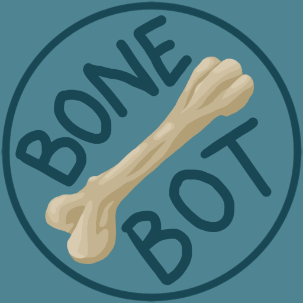

<div align="center">
  
</div>
<!-- Of course centering sucks, it's based on HTML...-->

# Bone Bot
The 'bone head' <!-- I don't know if I should laugh or barf...-->
bot for the Dogghouse Discord server.

## Commands
### Bone Sailor
Engage in a swashbucklin' swear off with the bot.
Reply to keep the fight going
```
/bone-sailor
```
### Bone Sus
Convert the passed in image to be full of
twerking crew mates from the hit game 'Among Us'

`width`: The number of crew mates to put across the resulting image

```
/bone-sus image [width]
```
### Bone Teams: Channel
Randomly rolls teams based on who is present
in a voice channel.

Generates team names from the 'insults' lists

If more members are present then what may be placed
into a team, they will be placed in an additional
team tagged 'Extras'

`channel`: The voice channel to pull participants from

`team-count`: The number of teams to generate (default: 2)

`team-size`: The size of team to generate (default: # of members / `team-count`)

`captain-role`: (Not done, lol) Role of a 'captain' of a team. Two captains will not be placed on one team

```
/bone-teams channel channel [team-count] [team-size] [captain-role]
```

### Bone Teams: Event
Randomly rolls teams based on who has marked
themselves as 'interested' in an event

Generates team names from the 'insults' lists

If more members are present then what may be placed
into a team, they will be placed in an additional
team tagged 'Extras'

`event-url`: The URL for the event

`team-count`: The number of teams to generate (default: 2)

`team-size`: The size of team to generate (default: # of members / `team-count`)

`captain-role`: (Not done, lol) Role of a 'captain' of a team. Two captains will not be placed on one team

```
/bone-teams event event-url [team-count] [team-size] [captain-role]
```

## Development
### Requirements
* CMake 3.26
* C++20 Compliant Compiler:
  * Tested with GCC 12.3.0
* vcpkg Package Manager: https://vcpkg.io/en/getting-started
* (Optional) Rust (for `bone-sus`) uses [rusty-sussy](https://github.com/The-Dogghouse/rusty-sussy)
  * Gifski: https://gif.ski/
* An API Key from Discord
### Cloning
You'll need to do a recursive clone since we've got a submodule
```shell
git clone --recursive git@github.com:The-Dogghouse/bone-bot.git
```

If you forgot to do this it'll fail to build, and you'll
be forced to actually read the README for how to do this.

If you need the submodule after you cloned, run the following
in the root of the project:
```shell
git submodule init
git submodule update
```
### Building
Run all the following in the project root

You'll need CMake option for `vcpkg`. To print it
run the following:
```shell
vcpkg integrate install
```
Configure the project to build in a directory called `build/`
in the project root. This may take a moment as it'll
pull the dependencies from `vcpkg.json`

To do a debug build, change `DCMAKE_BUILD_TYPE` from `Release`
to `Debug`

```shell
cmake -B build/ -S . -DCMAKE_BUILD_TYPE=Release -DCMAKE_TOOLCHAIN_FILE=[output from earlier]
```

To actually build, run the following:

```shell
cmake --build build/ --parallel
```

### rusty-sussy
To enable the `bone-sus` command, you'll need to
build `rusty-sussy`.

`cd` into the `susser/` directory
```shell
cd susser/
```

Build the release version with `cargo`
```shell
cargo build --release
```
